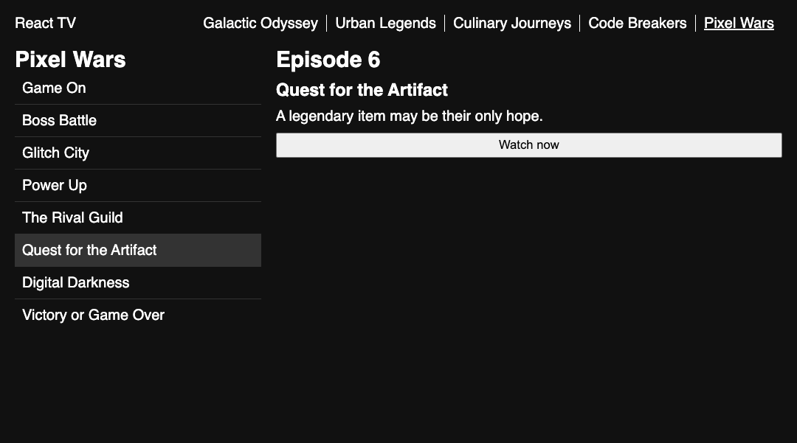

# React TV

Previously, you built an app that displays the episodes of a single TV show. This time, you'll work on React TV: a web streaming platform that allows users to browse through the episodes of a variety of different shows.

A [live demo of the finished project](https://fsa-react-tv.netlify.app/) is available as
reference.

## Getting Started

Rather than starting from scratch, this time you'll be working with an existing codebase. The `<EpisodeList>` and `<EpisodeDetails>` components are already built for you in the `src/episodes` folder. They have been refactored to take props, but are otherwise identical to the previous workshop.

Take some time to familiarize yourself with the code before starting to work on the new features, since you will have to interact with these components.

> [!NOTE]
>
> As we work on larger projects, the number of files to keep track of will continue to increase!
> To keep things organized, you'll often find related files grouped together in subdirectories within `src`.

## Instructions

Build out the `<App>`, `<ShowDetails>`, and `<ShowSelection>` components to render the data in `src/shows/data.js`. Your submission should meet the following requirements. You are recommended to do this workshop in the order given, but feel free to adjust as needed.

### ShowDetails

1. `<ShowDetails>` takes a `show` as a prop.
2. `<ShowDetails>` keeps the selected episode in a state variable.
3. If no show is provided, `<ShowDetails>` renders a message encouraging the user to select a show.
4. If a show is provided, `<ShowDetails>` renders `<EpisodeList>` and `<EpisodeDetails>`.
5. `<EpisodeList>` and `<EpisodeDetails>` are provided the correct props. Read the source code of these components to figure out what props they expect!

### ShowSelection

6. `<ShowSelection>` takes two props: a list of `shows` and a function to `setSelectedShow`.
7. Within the `<nav>`, each show is rendered as `<a class="show">` with the name of the show as both the key and the text of the anchor.
8. When a show is clicked, the selected show is updated in state to the show that was clicked.

### App

9. `<App>` imports the array from `data` into a state variable. Look very carefully at the
   location of `data.js`! It is not a sibling of `App.jsx`.
10. `<App>` keeps the selected show in a state variable.
11. `<App>` renders `<ShowSelection>` within the `<header>` and `<ShowDetails>` within the `<main>`.
12. `<ShowSelection>` and `<ShowDetails>` are provided the correct props. You just wrote these components, so you should know what props they expect!

## Submission

Please submit the link to your public GitHub repository.
# react-tv-solution
